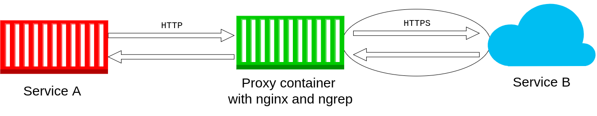

# HTTPS proxy Docker image

This repo contains a Dockerfile of an image with **nginx** and **ngrep**. It can be useful for viewing requests between services, that are talking to each other using HTTPS.

You can use this image for debugging purposes in a setup presented in the diagram above. In short, you can point your service (the red one) to HTTPS proxy container (created from this image - green) and then use ngrep on it to see the requests and responses it sends to the Service B.

More info:
- How to use it: https://medium.com/@bszwej/viewing-docker-container-https-traffic-b3435e0ed907
- Docker Hub: https://hub.docker.com/r/0000bartek/nginx-ngrep
